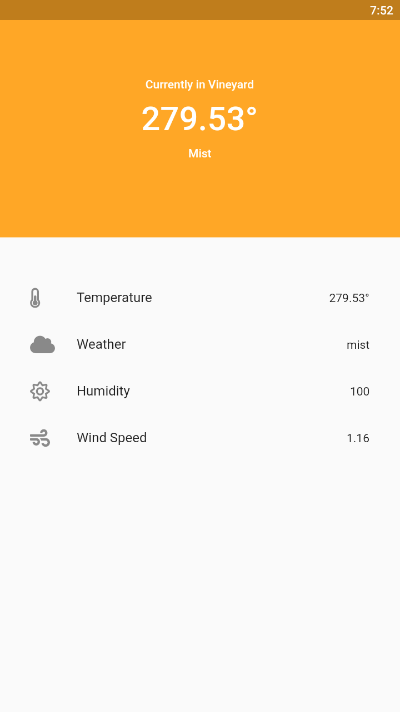

# Weather App

<p>A Weather App built using Flutter</p>

## User Interface



## Installation

<p>In the dependencies: section of your pubspec.yaml, add the following line:</p>

```dart
dependencies:
  font_awesome_flutter: <latest_version>
  http: <latest_version>
```

### API

<p>OpenWeather's Current weather data API</p>

```dart
api.openweathermap.org/data/2.5/weather?q={city name}&appid={API key}
```
